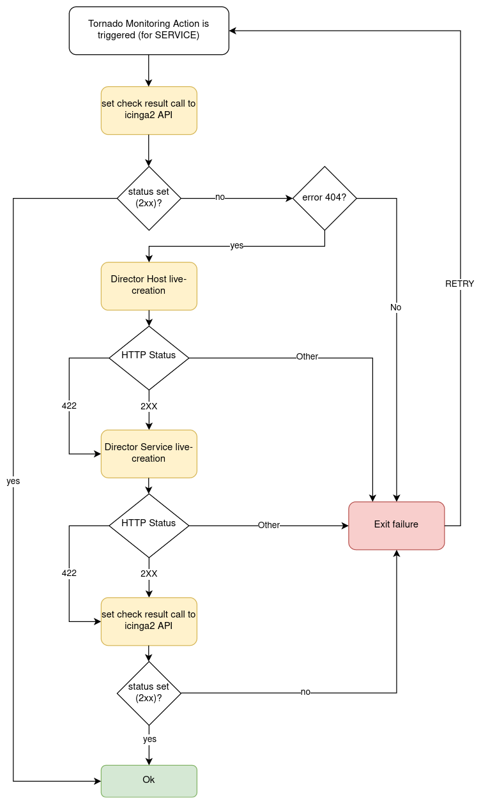

# Monitoring Executor

The Monitoring Executor is an executor that permits to perform Icinga `process check results` 
also in the case that the Icinga object for which you want to perform the `process check result`
does not yet exist.

This is done by means of executing the action `process check result` with the Icinga Executor, 
and by executing the actions `create_host`/`create_service` with the Director Executor, in case
the underlying Icinga objects do not yet exist in Icinga.

> ### Important!
>
> The Monitoring Executor requires the live-creation feature of the Icinga Director to be exposed in the REST API.
> If this is not the case, the actions of this executor will always fail in case the Icinga Objects are not already
> present in Icinga2.

## How It Works

This executor expects a Tornado Action to include the following elements in its payload:

1. An __action_name__: The Monitoring action to perform.
1. A __process_check_result_payload__: The payload for the Icinga2 `process check result` action.
1. A __host_creation_payload__: The payload which will be sent to the Icinga Director REST API for the host creation.
1. A __service_creation_payload__: The payload which will be sent to the Icinga Director REST API for the service creation
(mandatory only in case __action_name__ is `create_and_or_process_service_passive_check_result`). 

Valid values for __action_name__ are:
* __create_and_or_process_host_passive_check_result__: sets the `passive check result` for a `host`, and, if necessary, 
it also creates the host.
* __create_and_or_process_service_passive_check_result__: sets the `passive check result` for a `service`, and, if
necessary, it also creates the service.

The __process_check_result_payload__ should contain at least all mandatory parameters expected by the
Icinga API to perform the action. The object on which you want to set the `passive check result` must be specified
with the field `host` in case of action __create_and_or_process_host_passive_check_result__, and `service` in case of
action __create_and_or_process_service_passive_check_result__ (e.g. specifying a set of objects on which to apply the
`passive check result` with the parameter `filter` is not valid)

The __host_creation_payload__ should contain at least all mandatory parameters expected by the Icinga Director REST API
to perform the creation of a host.

The __servie_creation_payload__ should contain at least all mandatory parameters expected by the Icinga Director REST API
to perform the creation of a service.

An example of a valid Tornado Action is:
```json
{
  "id": "monitoring",
  "payload": {
    "action_name": "create_and_or_process_service_passive_check_result",
    "process_check_result_payload": {
      "exit_status": "2",
      "plugin_output": "Output message",
      "service": "myhost!myservice",
      "type": "Service"
    },
    "host_creation_payload": {
      "object_type": "Object",
      "object_name": "myhost",
      "address": "127.0.0.1",
      "check_command": "hostalive",
      "vars": {
        "location": "Rome"
      }
    },
    "service_creation_payload": {
      "object_type": "Object",
      "host": "myhost",
      "object_name": "myservice",
      "check_command": "ping"
    }
  }
}
```

Below is a flowchart that helps to understand the behaviour of the Monitoring Executor in relation to Icinga2 and Icinga
Director REST APIs.

