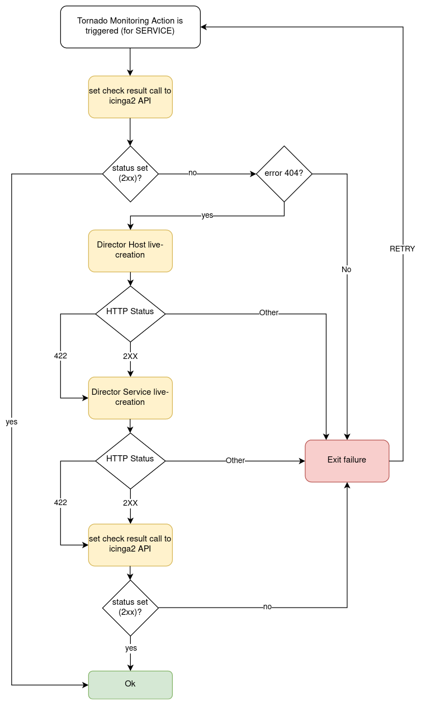

# Smart Monitoring Check Result Executor

The Smart Monitoring Check Result Executor permits to perform an Icinga `process check results` 
also in case the Icinga object for which you want to carry out that action does not exist.

This is done by first running the action `process check result` with the Icinga Executor, 
and then, in case the underlying Icinga objects do not exist in Icinga, 
the actions `create_host`/`create_service` with the Director Executor.

> ### Important!
>
> The Smart Monitoring Check Result Executor requires the live-creation feature of the Icinga Director to be exposed in the REST API.
> If this is not the case, the actions of this executor will always fail in case the Icinga Objects are not already
> present in Icinga2.

## How It Works

This executor expects a Tornado Action to include the following elements in its payload:

1. A __check_result__: The basic data to build the Icinga2 `process check result` action payload.
1. A __host__: The data to build the payload which will be sent to the Icinga Director REST API for the host creation.
1. A __service__: The data to build the payload which will be sent to the Icinga Director REST API for the service creation
(optional). 

The __check_result__ should contain all mandatory parameters expected by the
Icinga API except the following ones that are automatically filled by the executor:
- `host`
- `service`
- `type`

The __host__ and __service__ should contain all mandatory parameters expected by the Icinga Director REST API to perform the creation of a host
and/or a service, except:
- `object_type`

The __service__ key is optional. When it is included in the action payload, the executor will invoke the `process check results`
call to set the status of a service; otherwise, it will set the one of a host.

An example of a valid Tornado Action is to set the status of the service `myhost|myservice`:
```json
    {
      "id": "smart_monitoring_check_result",
      "payload": {
        "check_result": {
          "exit_status": "2",
          "plugin_output": "Output message"
        },
        "host": {
          "object_name": "myhost",
          "address": "127.0.0.1",
          "check_command": "hostalive",
          "vars": {
            "location": "Rome"
          }
        },
        "service": {
           "object_name": "myservice",
           "check_command": "ping"
        }
      }
    }
```

By simply removing the `service` key, the same action will set the status of the host `myhost`:
                                                                                 
```json
     {
       "id": "smart_monitoring_check_result",
       "payload": {
         "check_result": {
           "exit_status": "2",
           "plugin_output": "Output message"
         },
         "host": {
           "object_name": "myhost",
           "address": "127.0.0.1",
           "check_command": "hostalive",
           "vars": {
             "location": "Rome"
           }
         }
       }
     }
```

Below is a flowchart that helps understand the behaviour of the Smart Monitoring Check Result Executor in relation to Icinga2 and Icinga
Director REST APIs.

