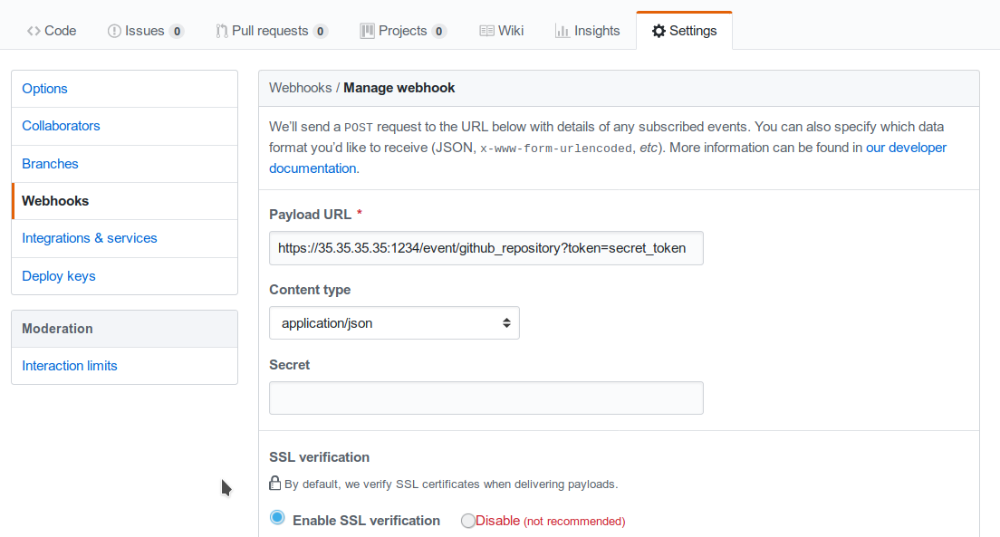

# Webhook Collector (binary) 

The webhook collector is a standalone HTTP server that listens for REST calls 
from a generic webhook.

It generates Tornado Events from the webhook JSON body and publishes them on the 
Tornado UDS socket.

## How it works

The webhook collector executable is an HTTP server built on 
[actix-web](https://github.com/actix/actix-web).

At startup, it creates a dedicated REST endpoint
for each configured webhook. Calls received by an endpoint are 
processed by the embedded [jmespath collector](../../../collector/jmespath/doc/README.md)
that produces Tornado Events from them; finally, the Events are forwarded to the Tornado 
executable UDS socket.

For each webhook, to successfully create an endpoint, we have to provide three values:
- _id_: the webhook identifier. This will determine the path of the endpoint; it must be 
  unique per webhook.
- _token_: a security token that the webhook issuer has to include as part of the URL the query 
  string. If the token provided by the issuer is missing or does not match the one owned by the 
  collector, the call will be rejected and an HTTP 401 code (UNAUTHORIZED) is returned.   
- _collector_config_: The transformation logic that converts a webhook JSON into a Tornado Event.
  It consists of a JMESPath collector configuration as described by the 
  [specific documentation](../../../collector/jmespath/doc/README.md).
  

## Configuration

The executable configuration is partially on configuration files
and partially on command line parameters.

The available startup parameters are:
- __logger-stdout__: Determines whether the Logger should print to standard output. 
  Valid values: true, false. False by default.
- __logger-file-path__: A file path in the file system; if provided, the Logger will 
  append any output to it.
- __logger-level__: The Logger level; valid values: _trace_, _debug_, _info_, _warn_, _error_.
  The default value is _warn_.
- __config-dir__: The filesystem folder from where the Tornado configuration is read.
  The default path is _/etc/tornado_webhook_collector/_
- __webhooks_dir__: The folder where the Webhook configurations are saved in JSON format; 
  this folder is relative to the `config_dir`. The default value is _/webhooks/_
- __uds-path__: The Unix Socket path where outgoing events will be written. 
  This should be the path where Tornado is listening for incoming events.
  By default it is _/var/run/tornado/tornado.sock_
- __uds_mailbox_capacity__: The Events in-memory buffer size. 
  It makes the application resilient to Tornado crashes or temporary unavailability.
  When Tornado will be working again, all messages in the buffer will be sent. 
  When the buffer is full, the collector will start loosing messages.
  The default buffer value is 10000.
- __bind_address__: IP to bind the HTTP server to. The default value is "0.0.0.0". 
- __server_port__: The port to be use by the HTTP Server. The default value is 8080.


More information about the logger configuration are available 
[here](../../../common/logger/doc/README.md).


An example of a full startup command is:
```bash
./tornado_webhook_collector \
      --logger-stdout --logger-level=debug \
      --config-dir=/tornado-webhook-collector/config \
      --bind_address=127.0.0.1
      --server-port=1234
      --uds-path=/tmp/tornado
```

In this case the Webhook Collector:
- logs to standard output at debug level
- reads the configuration from the _/tornado-webhook-collector/config_ directory,
- searches for webhook configurations in the _/tornado-webhook-collector/config/webhooks_ directory,
- binds the HTTP server to the 127.0.0.1 IP,
- starts the HTTP server at port 1234,
- writes outcoming Events to the UDS socket at _/tmp/tornado_.   


## Webhooks configuration

As described before, the two startup parameters _config-dir_ and _webhooks_dir_ 
determine the path to the Webhook configurations. In addition, as already reported, 
each webhook configuration is achieved providing _id_, _token_ and _collector_config_.

As an example, let's now configure a webhook for a repository hosted on 
[Github](https://github.com/).

If we start the application using the command line provided on the previous chapter,
the webhook configuration files should be in the _/tornado-webhook-collector/config/webhooks_
directory.
Into this directory, each configuration is saved into a separated file in JSON format:
```
/tornado-webhook-collector/config/webhooks
                 |- github.json
                 |- bitbucket_first_repository.json
                 |- bitbucket_second_repository.json
                 |- ...
```

The alphabetical order has no impact on the configuration.

An example of a valid content for a Webhook configuration JSON file is:
```json
{
  "id": "github_repository",
  "token": "secret_token",
  "collector_config": {
    "event_type": "${commits[0].committer.name}",
    "payload": {
      "source": "github",
      "ref": "${ref}",
      "repository_name": "${repository.name}"
    }
  }
}
```

This configuration predisposes the creation of the endpoint:

__http(s)://collector_ip:collector_port/event/github_repository__

However, the Github webhook issuer must pass the token on each call; consequently,
the final URL to be called will be:
  
__http(s)://collector_ip:collector_port/event/github_repository?token=secret_token__

__Security warning__: Due to the fact that the security token is present in the query string, 
it is extremely important that the webhook collector is always deployed in production
using HTTPS; otherwise, the token will be sent unencrypted along with the
entire URL.

Consequently, if the public IP of the collector is, for example, 35.35.35.35 and the server 
port is 1234, in Github, the webhook settings page should look like:


Finally, the _collector_config_ configuration entry determines the content of the tornado Event 
associated with each webhook input.

In this case, if Github sends this JSON (showing only needed parts):
```json
{
  "ref": "refs/heads/master",
  ...
  "commits": [
    {
      "id": "33ad3a6df86748011ee8d5cef13d206322abc68e",
      ...
      "committer": {
        "name": "GitHub",
        "email": "noreply@github.com",
        "username": "web-flow"
      }
    }
  ],
  ...
  "repository": {
    "id": 123456789,
    "name": "webhook-test",
    ...
  }
}
``` 

The resulting Event will be:
```json
{
  "type": "GitHub",
  "created_ts": "2018-12-28T21:45:59.324310806+09:00",
  "payload": {
    "source": "github",
    "ref": "refs/heads/master",
    "repository_name": "webhook-test"
  }
}
```

The Event creation logic is internally handled by the JMESPath collector,
detailed description of which is available in the 
[specific documentation](../../../collector/jmespath/doc/README.md). 
