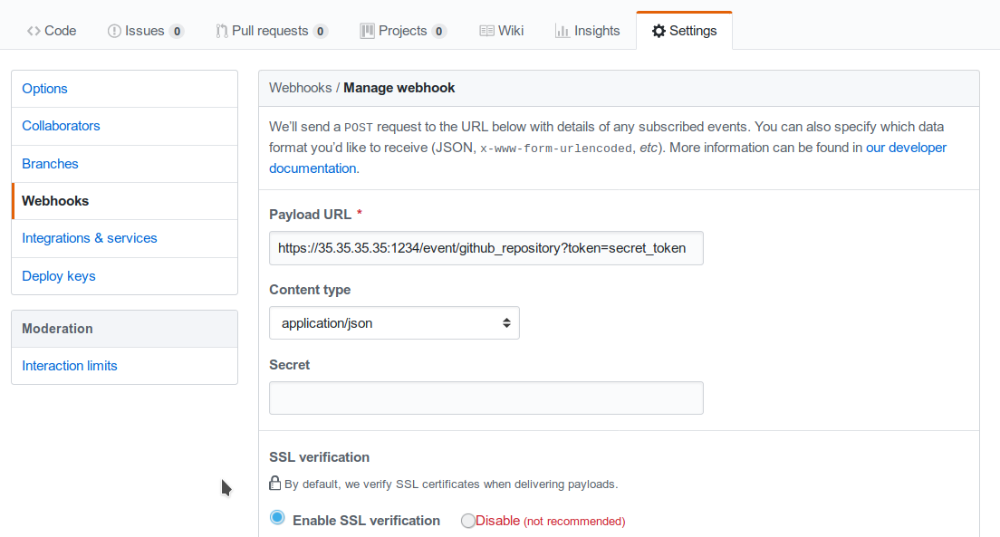

# Tornado Webhook Collector (executable)

The Webhook Collector is a standalone HTTP server that listens for REST calls from a generic
webhook, generates Tornado Events from the webhook JSON body, and sends them to the
Tornado Engine.


## How It Works

The webhook collector executable is an HTTP server built on
[actix-web](https://github.com/actix/actix-web).

On startup, it creates a dedicated REST endpoint for each configured webhook. Calls received by
an endpoint are processed by the embedded
[jmespath collector](../../collector/jmespath/README.md)
that uses them to produce Tornado Events. In the final step, the Events are forwarded to the
Tornado Engine through the configured connection type.

For each webhook, you must provide these values in order to successfully create an endpoint:
- _id_:  The webhook identifier. This will determine the path of the endpoint; it must be
  unique per webhook.
- _token_:  A security token that the webhook issuer has to include in the URL as part of the
  query string (see the example at the bottom of this page for details). If the token provided
  by the issuer is missing or does not match the one owned by the collector, then the call will
  be rejected and an HTTP 401 code (UNAUTHORIZED) will be returned.
- _max_payload_size_ (optional):  This value defines the maximum size in bytes of the payload sent
  to the collector. If not provided, it will default to 5MB (5_242_880 bytes). The value can be passed as
  human-readable form, thanks to [human_units](https://docs.rs/human-units/latest/human_units/) crate.
- *collector_config*:  The transformation logic that converts a webhook JSON object into a Tornado
  Event. It consists of a JMESPath collector configuration as described in its
  [specific documentation](../../collector/jmespath/README.md).


## Configuration

The executable configuration is based partially on configuration files, and partially on command
line parameters.

The available startup parameters are:
- __config-dir__:  The filesystem folder from which the collector configuration is read.
  The default path is _/etc/tornado_webhook_collector/_.
- __webhooks-dir__:  The folder where the Webhook configurations are saved in JSON format;
  this folder is relative to the `config_dir`. The default value is _/webhooks/_.

In addition to these parameters, the following configuration entries are available in the 
file _'config-dir'/webhook_collector.toml_:
- __logger__:
    - __level__:  The Logger level; valid values are _trace_, _debug_, _info_, _warn_, and
      _error_.
    - __stdout__:  Determines whether the Logger should print to standard output.
      Valid values are `true` and `false`.
    - __file_output_path__:  A file path in the file system; if provided, the Logger will
      append any output to it.
- **webhook_collector**:
    - **tornado_event_socket_ip**: The IP address where outgoing events will be written.
      This should be the address where the Tornado Engine listens for incoming events.
      If present, this value overrides what specified by the `tornado_connection_channel` entry.
      *This entry is deprecated and will be removed in the next release of tornado. Please, use the `tornado_connection_channel` instead.*
    - **tornado_event_socket_port**:  The port where outgoing events will be written.
      This should be the port where the Tornado Engine listens for incoming events.
      This entry is mandatory if `tornado_connection_channel` is set to `TCP`.
      If present, this value overrides what specified by the `tornado_connection_channel` entry.
      *This entry is deprecated and will be removed in the next release of tornado. Please, use the `tornado_connection_channel` instead.*
    - **message_queue_size**:  The in-memory buffer size for Events. It makes the application
      resilient to errors or temporary unavailability of the Tornado connection channel.
      When the connection on the channel is restored, all messages in the buffer will be sent.
      When the buffer is full, the collector will start discarding older messages first.
    - **server_bind_address**:  The IP to bind the HTTP server to.
    - **server_port**:  The port to be used by the HTTP Server.
    - **tornado_connection_channel**: The channel to send events to Tornado. It contains the set of entries
    required to configure a *Nats* or a *TCP* connection.
    *Beware that this entry will be taken into account only if `tornado_event_socket_ip` and `tornado_event_socket_port` are not provided.*  
        - In case of connection using *Nats*, these entries are mandatory:
            - **nats.client.addresses**: The addresses of the  NATS server.
            - **nats.client.auth.type**:  The type of authentication used to authenticate to NATS
            (Optional. Valid values are `None` and `Tls`. Defaults to `None` if not provided).
            - **nats.client.auth.certificate_path**:  The path to the client certificate (in `.pem` format) that will be
            used for authenticating to NATS.
            (Mandatory if `nats.client.auth.type` is set to `Tls`).
            - **nats.client.auth.private_key_path**:  The path to the client certificate private key (in `.pem` format)
            that will be used for authenticating to NATS.
            - **nats.client.auth.path_to_root_certificate**:  The path to a root certificate (in `.pem` format) to trust in
            addition to system's trust root. May be useful if the NATS server is not trusted by the system as default.
            (Optional, valid if `nats.client.auth.type` is set to `Tls`).
            - **nats.subject**: The NATS Subject where tornado will subscribe and listen for incoming events.
        - In case of connection using *TCP*, these entries are mandatory:
            - **tcp_socket_ip**:  The IP address where outgoing events will be written.
              This should be the address where the Tornado Engine listens for incoming events.
            - **tcp_socket_port**:  The port where outgoing events will be written.
              This should be the port where the Tornado Engine listens for incoming events.

   
More information about the logger configuration
[is available here](../../common/logger/README.md).

The default __config-dir__ value can be customized at build time by specifying
the environment variable *TORNADO_WEBHOOK_COLLECTOR_CONFIG_DIR_DEFAULT*. 
For example, this will build an executable that uses */my/custom/path* 
as the default value:
```bash
TORNADO_WEBHOOK_COLLECTOR_CONFIG_DIR_DEFAULT=/my/custom/path cargo build 
```

An example of a full startup command is:
```bash
./tornado_webhook_collector \
      --config-dir=/tornado-webhook-collector/config
```

In this example the Webhook Collector starts up and then reads 
the configuration from the _/tornado-webhook-collector/config_ directory.


## Webhooks Configuration

As described before, the two startup parameters _config-dir_ and _webhooks-dir_ determine the path
to the Webhook configurations, and each webhook is configured by providing _id_, _token_ and
_collector_config_.

As an example, consider how to configure a webhook for a repository hosted on
[GitHub](https://github.com/).

If we start the application using the command line provided in the previous section, the webhook
configuration files should be located in the _/tornado-webhook-collector/config/webhooks_
directory. Each configuration is saved in a separate file in that directory in JSON format
(the order shown in the directory is not necessarily the order in which the hooks are processed):
```
/tornado-webhook-collector/config/webhooks
                 |- github.json
                 |- bitbucket_first_repository.json
                 |- bitbucket_second_repository.json
                 |- ...
```

An example of valid content for a Webhook configuration JSON file is:
```json
{
  "id": "github_repository",
  "token": "secret_token",
  "collector_config": {
    "event_type": "${commits[0].committer.name}",
    "payload": {
      "source": "github",
      "ref": "${ref}",
      "repository_name": "${repository.name}"
    }
  }
}
```

This configuration defines that this endpoint will be created:

http(s)://collector_ip:collector_port/event/__github_repository__

However, the GitHub webhook issuer must pass the __token__ at each call. Consequently, the actual URL
to be called will have this structure:

__http(s)://collector_ip:collector_port/event/github_repository?token=secret_token__

__Security warning:__  Since the security token is present in the query string, it is extremely
important that the webhook collector is always deployed with HTTPS in production. Otherwise, the
token will be sent unencrypted along with the entire URL.

Consequently, if the public IP of the collector is, for example, 35.35.35.35 and the server
port is 1234, in GitHub, the webhook settings page should look like this:



The value for __max_payload_size__ is optional, and in our case will reduce the maximum payload size
to about 2MB.

Finally, the *collector_config* configuration entry determines the content of the tornado Event
associated with each webhook input.

So for example, if GitHub sends this JSON (only the relevant parts shown here):
```json
{
  "ref": "refs/heads/master",
  ...
  "commits": [
    {
      "id": "33ad3a6df86748011ee8d5cef13d206322abc68e",
      ...
      "committer": {
        "name": "GitHub",
        "email": "noreply@github.com",
        "username": "web-flow"
      }
    }
  ],
  ...
  "repository": {
    "id": 123456789,
    "name": "webhook-test",
    ...
  }
}
```

then the resulting Event will be:
```json
{
  "type": "GitHub",
  "created_ms": 1554130814854,
  "payload": {
    "source": "github",
    "ref": "refs/heads/master",
    "repository_name": "webhook-test"
  }
}
```

The Event creation logic is handled internally by the JMESPath collector, a
detailed description of which is available in its
[specific documentation](../../collector/jmespath/README.md).
